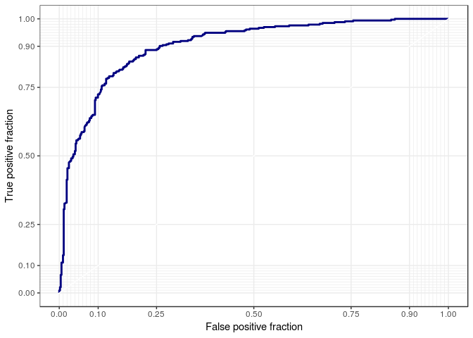
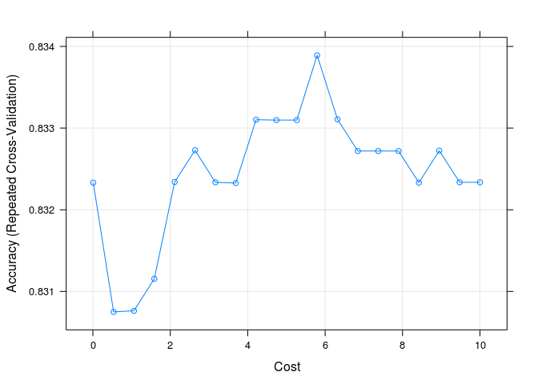
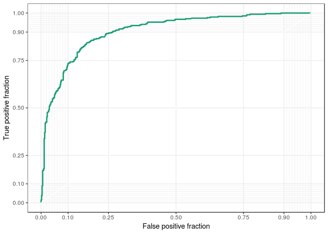
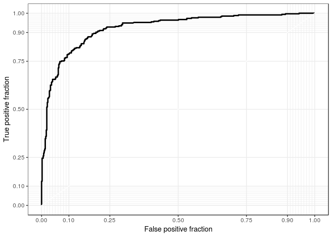

Untitled
================
Xiao Li
3/5/2019

1.  This question refers to Chapter 9 Problem 8 beginning on page 371 in the text.

    1.  Create a training sample that has roughly 80% of the observations. Use `set.seed(19823)`.
    2.  Use the `kernlab` package to fit a support vector classifier to the training data using `C = 0.01`.
    3.  Compute the confusion matrix for the training data. Report the overall error rates, sensitivity, and specificity.
    4.  Construct the ROC curve.
    5.  Use the `train` function from the `caret` package to find an optimal cost parameter (`C`) in the range 0.01 to 10. Use `seq(0.01, 10, len = 20)`.
    6.  Compute the training and test classification error.
    7.  Repeat (b) - (d) using an SVM with a polynomial kernel with degree 2.
    8.  Which method would you choose?
    9.  Repeat (b) - (d) using an SVM with a radial basis kernel. Train it.
    10. Using the best models from LDA, SVC, SVM (poly), and SVM (radial), compute the test error.
    11. Which method would you choose?

``` r
df <- tbl_df(OJ)
```

``` r
set.seed(19823)
inTraining <- createDataPartition(df$Purchase,
                                  p = .8,
                                  list = F)
training <- df[inTraining,]
testing <- df[-inTraining,]
```

SVC: C = 0.01

``` r
OJ_svc <- ksvm(Purchase ~ ., data = training,
                  type = "C-svc", kernel = 'vanilladot', C = .01, prob.model = TRUE)
```

    ##  Setting default kernel parameters

``` r
fits_svc <- predict(OJ_svc, newdata = training, type = "probabilities")
new_fits <- mutate(training, 
                   svc_probs = fits_svc[, 2],
                   default = if_else(Purchase == "MM", 1, 0))
p <- ggplot(data = new_fits,
            aes(d = default, m = svc_probs))
p + geom_roc(n.cuts = 0, col = "navy") +
  style_roc()
```



``` r
confusionMatrix(table(predict(OJ_svc, newdata = testing), testing$Purchase), positive = "MM")
```

    ## Confusion Matrix and Statistics
    ## 
    ##     
    ##       CH  MM
    ##   CH 117  24
    ##   MM  13  59
    ##                                           
    ##                Accuracy : 0.8263          
    ##                  95% CI : (0.7686, 0.8746)
    ##     No Information Rate : 0.6103          
    ##     P-Value [Acc > NIR] : 7.121e-12       
    ##                                           
    ##                   Kappa : 0.6258          
    ##  Mcnemar's Test P-Value : 0.1002          
    ##                                           
    ##             Sensitivity : 0.7108          
    ##             Specificity : 0.9000          
    ##          Pos Pred Value : 0.8194          
    ##          Neg Pred Value : 0.8298          
    ##              Prevalence : 0.3897          
    ##          Detection Rate : 0.2770          
    ##    Detection Prevalence : 0.3380          
    ##       Balanced Accuracy : 0.8054          
    ##                                           
    ##        'Positive' Class : MM              
    ## 

SVC-Cross Validation:

``` r
fit_control <- trainControl(method = "repeatedcv",
                           number = 10, 
                           repeats = 3)
OJ_train <- train(Purchase ~ .,
                  data = training,
                  method = "svmLinear",
                  trControl = fit_control,
                  tuneGrid = data.frame(C = seq(0.01, 10, len = 20))) # buffer
OJ_train
```

    ## Support Vector Machines with Linear Kernel 
    ## 
    ## 857 samples
    ##  17 predictor
    ##   2 classes: 'CH', 'MM' 
    ## 
    ## No pre-processing
    ## Resampling: Cross-Validated (10 fold, repeated 3 times) 
    ## Summary of sample sizes: 772, 771, 771, 771, 771, 772, ... 
    ## Resampling results across tuning parameters:
    ## 
    ##   C           Accuracy   Kappa    
    ##    0.0100000  0.8323317  0.6444388
    ##    0.5357895  0.8307495  0.6425290
    ##    1.0615789  0.8307630  0.6421775
    ##    1.5873684  0.8311552  0.6428536
    ##    2.1131579  0.8323407  0.6449671
    ##    2.6389474  0.8327283  0.6454332
    ##    3.1647368  0.8323361  0.6445091
    ##    3.6905263  0.8323271  0.6446920
    ##    4.2163158  0.8331024  0.6462791
    ##    4.7421053  0.8330978  0.6462636
    ##    5.2678947  0.8330978  0.6462760
    ##    5.7936842  0.8338913  0.6479437
    ##    6.3194737  0.8331070  0.6464196
    ##    6.8452632  0.8327194  0.6455461
    ##    7.3710526  0.8327194  0.6455461
    ##    7.8968421  0.8327194  0.6455430
    ##    8.4226316  0.8323318  0.6446599
    ##    8.9484211  0.8327239  0.6452945
    ##    9.4742105  0.8323363  0.6443927
    ##   10.0000000  0.8323363  0.6443927
    ## 
    ## Accuracy was used to select the optimal model using the largest value.
    ## The final value used for the model was C = 5.793684.

``` r
plot(OJ_train)
```



Confusion matrix on the cross validation sets:

``` r
confusionMatrix(OJ_train)
```

    ## Cross-Validated (10 fold, repeated 3 times) Confusion Matrix 
    ## 
    ## (entries are percentual average cell counts across resamples)
    ##  
    ##           Reference
    ## Prediction   CH   MM
    ##         CH 53.5  9.1
    ##         MM  7.5 29.9
    ##                             
    ##  Accuracy (average) : 0.8339

``` r
confusionMatrix(table(predict(OJ_train, newdata = testing), 
                      testing$Purchase), positive = "MM")
```

    ## Confusion Matrix and Statistics
    ## 
    ##     
    ##       CH  MM
    ##   CH 114  20
    ##   MM  16  63
    ##                                           
    ##                Accuracy : 0.831           
    ##                  95% CI : (0.7738, 0.8787)
    ##     No Information Rate : 0.6103          
    ##     P-Value [Acc > NIR] : 2.296e-12       
    ##                                           
    ##                   Kappa : 0.6415          
    ##  Mcnemar's Test P-Value : 0.6171          
    ##                                           
    ##             Sensitivity : 0.7590          
    ##             Specificity : 0.8769          
    ##          Pos Pred Value : 0.7975          
    ##          Neg Pred Value : 0.8507          
    ##              Prevalence : 0.3897          
    ##          Detection Rate : 0.2958          
    ##    Detection Prevalence : 0.3709          
    ##       Balanced Accuracy : 0.8180          
    ##                                           
    ##        'Positive' Class : MM              
    ## 

SVM:

``` r
OJ_svm <- ksvm(Purchase ~ ., 
               data = training,
               type = "C-svc", kernel = 'polydot', 
               kpar = list(degree = 2, scale = .1), 
               C = .01, prob.model = T)

fits_svm <- predict(OJ_svm, newdata = training, type = "probabilities")
svm_pred <- mutate(new_fits, svm_probs = fits_svm[, 2])
p <- ggplot(data = svm_pred,
            aes(d = default, m = svm_probs))
p + geom_roc(n.cuts = 0, col = "#1b9e77") +
  style_roc()
```



``` r
confusionMatrix(table(predict(OJ_svm, newdata = testing), 
                      testing$Purchase), positive = "MM")
```

    ## Confusion Matrix and Statistics
    ## 
    ##     
    ##       CH  MM
    ##   CH 123  28
    ##   MM   7  55
    ##                                          
    ##                Accuracy : 0.8357         
    ##                  95% CI : (0.779, 0.8828)
    ##     No Information Rate : 0.6103         
    ##     P-Value [Acc > NIR] : 7.167e-13      
    ##                                          
    ##                   Kappa : 0.638          
    ##  Mcnemar's Test P-Value : 0.0007232      
    ##                                          
    ##             Sensitivity : 0.6627         
    ##             Specificity : 0.9462         
    ##          Pos Pred Value : 0.8871         
    ##          Neg Pred Value : 0.8146         
    ##              Prevalence : 0.3897         
    ##          Detection Rate : 0.2582         
    ##    Detection Prevalence : 0.2911         
    ##       Balanced Accuracy : 0.8044         
    ##                                          
    ##        'Positive' Class : MM             
    ## 

SVM-radial:

``` r
OJ_svm_rad <- ksvm(Purchase ~ ., data = training,
                   type = "C-svc", kernel = 'rbfdot', 
                   kpar = list(sigma = .1), #sigma is similar to the effect of scale parameter
                   prob.model = T)
fits_svm_rad <- predict(OJ_svm_rad, newdata = training, type = "probabilities")
```

``` r
svm_pred_rad <- mutate(svm_pred, svm_probs_rad = fits_svm_rad[, 2])
p <- ggplot(data = svm_pred_rad,
            aes(d = default, m = svm_probs_rad))
p + geom_roc(n.cuts = 0) +
  style_roc() +
  scale_color_brewer(palette = "Dark2")
```



``` r
confusionMatrix(table(predict(OJ_svm_rad, newdata = testing), 
                      testing$Purchase), positive = "MM")
```

    ## Confusion Matrix and Statistics
    ## 
    ##     
    ##       CH  MM
    ##   CH 114  25
    ##   MM  16  58
    ##                                           
    ##                Accuracy : 0.8075          
    ##                  95% CI : (0.7481, 0.8582)
    ##     No Information Rate : 0.6103          
    ##     P-Value [Acc > NIR] : 4.816e-10       
    ##                                           
    ##                   Kappa : 0.5872          
    ##  Mcnemar's Test P-Value : 0.2115          
    ##                                           
    ##             Sensitivity : 0.6988          
    ##             Specificity : 0.8769          
    ##          Pos Pred Value : 0.7838          
    ##          Neg Pred Value : 0.8201          
    ##              Prevalence : 0.3897          
    ##          Detection Rate : 0.2723          
    ##    Detection Prevalence : 0.3474          
    ##       Balanced Accuracy : 0.7879          
    ##                                           
    ##        'Positive' Class : MM              
    ## 

By comparing the `Accuracy`, I will choose the SVM(poly) who has the highest `Accuracy`.

1.  Train one of the SVM models using a single core, 2 cores, and 4 cores. Compare the speedup (if any).

``` r
library(doMC)
```

    ## Loading required package: foreach

    ## 
    ## Attaching package: 'foreach'

    ## The following objects are masked from 'package:purrr':
    ## 
    ##     accumulate, when

    ## Loading required package: iterators

    ## Loading required package: parallel

``` r
registerDoMC(cores = 1)
OJ_svm_c1 <- system.time(ksvm(Purchase ~ ., 
                         data = training,
                         type = "C-svc", kernel = 'polydot', 
                         kpar = list(degree = 2, scale = .1), 
                         C = .01, prob.model = T))
OJ_svm_c1
```

    ##    user  system elapsed 
    ##   0.114   0.000   0.114

``` r
registerDoMC(cores = 2)

OJ_svm_c2 <- system.time(ksvm(Purchase ~ ., 
                         data = training,
                         type = "C-svc", kernel = 'polydot', 
                         kpar = list(degree = 2, scale = .1), 
                         C = .01, prob.model = T))
OJ_svm_c2
```

    ##    user  system elapsed 
    ##   0.116   0.000   0.116

``` r
registerDoMC(cores = 4)

OJ_svm_c4 <- system.time(ksvm(Purchase ~ ., 
                         data = training,
                         type = "C-svc", kernel = 'polydot', 
                         kpar = list(degree = 2, scale = .1), 
                         C = .01, prob.model = T))
OJ_svm_c4
```

    ##    user  system elapsed 
    ##   0.114   0.000   0.114

By comparing the system time shown above, we can tell that `single core` and `4 cores` have the same system time.

1.  You might want to look at `rbenchmark` or `microbenchmark` packages for timing.
